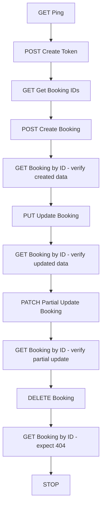
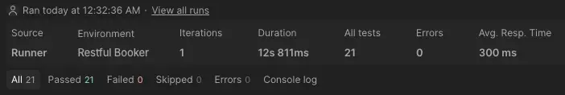
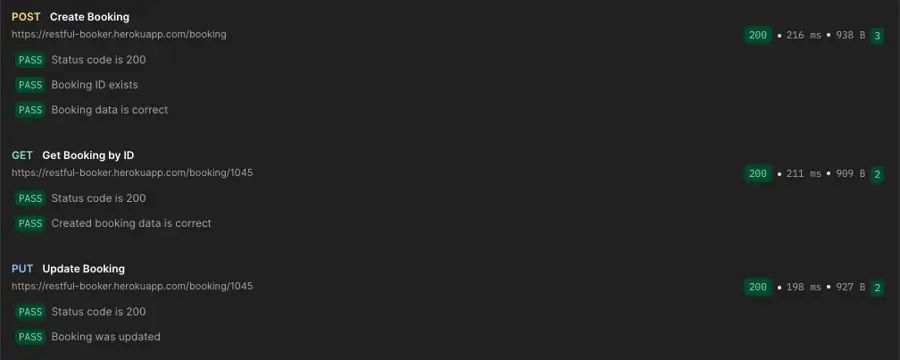
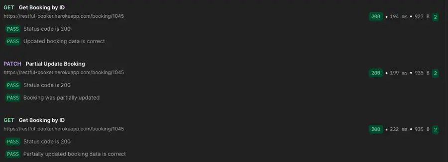

# Restful Booker API Testing

A Postman-based API testing project for the public **Restful Booker** service. The project covers authentication, CRUD operations, dynamic environment variables, assertions, and an automated end-to-end collection flow.

## Project goals

- Practice REST API testing with Postman
- Validate positive CRUD scenarios
- Work with authentication and environment variables
- Reuse dynamically created `token` and `bookingId` values
- Verify data after create, full update, partial update, and delete operations
- Run the entire API scenario automatically with Collection Runner / Newman

## API under test

Base URL:

```text
https://restful-booker.herokuapp.com
```

API documentation: `https://restful-booker.herokuapp.com/apidoc/index.html`

## Covered endpoints

| Method | Endpoint | Purpose |
|---|---|---|
| GET | `/ping` | Health check |
| POST | `/auth` | Create authentication token |
| GET | `/booking` | Get booking IDs |
| POST | `/booking` | Create a booking |
| GET | `/booking/{id}` | Get booking by ID |
| PUT | `/booking/{id}` | Full booking update |
| PATCH | `/booking/{id}` | Partial booking update |
| DELETE | `/booking/{id}` | Delete booking |

## Automated flow



The collection uses `pm.execution.setNextRequest()` and the `bookingStage` environment variable to control the flow and reuse **Get Booking by ID** at different verification stages.

## Dynamic variables

The Postman environment contains:

| Variable | Purpose |
|---|---|
| `baseUrl` | API base URL |
| `token` | Token returned by `POST /auth` |
| `bookingId` | ID returned by `POST /booking` |
| `bookingStage` | Controls the automated scenario stage |
| `adminUsername` | Public demo username |
| `adminPassword` | Public demo password |

`token`, `bookingId`, and `bookingStage` are managed automatically by test scripts.

## Assertions

The automated tests validate:

- HTTP status codes
- Presence of authentication token
- Response type for booking ID list
- Presence of `bookingid`
- Created booking data
- Updated booking data after PUT
- Partially updated data after PATCH
- Successful deletion
- `404 Not Found` after deleting the booking

## Test run evidence

Latest local Collection Runner execution during project setup:

- **21 tests**
- **21 passed**
- **0 failed**
- **0 errors**
- **12.811 s** total duration
- **300 ms** average response time

### Runner summary



### Create and full update



### Partial update verification



### Delete verification

The final GET intentionally returns **404 Not Found** after DELETE, and the assertion passes because the booking is expected to be gone.


Detailed run evidence: [`docs/runner-results.md`](docs/runner-results.md)

## How to run in Postman

1. Import `postman/Restful_Booker.postman_collection.json`.
2. Import `postman/Restful_Booker.postman_environment.json`.
3. Select the **Restful Booker** environment.
4. Open Collection Runner.
5. Run the collection with 1 iteration.
6. The scenario should finish with a successful `404` assertion after deletion.

## Run from CLI with Newman

Install Newman:

```bash
npm install -g newman
```

Run the collection:

```bash
newman run postman/Restful_Booker.postman_collection.json \
  -e postman/Restful_Booker.postman_environment.json
```

## CI

A GitHub Actions workflow is included in `.github/workflows/postman-tests.yml`. It runs the Postman collection with Newman on pushes, pull requests, and manual workflow dispatch.

## Repository structure

```text
restful-booker-api-testing/
├── .github/
│   └── workflows/
│       └── postman-tests.yml
├── docs/
│   ├── runner-results.md
│   └── test-scenarios.md
├── postman/
│   ├── Restful_Booker.postman_collection.json
│   └── Restful_Booker.postman_environment.json
├── screenshots/
│   ├── runner-summary.webp
│   ├── runner-create-update.webp
│   ├── runner-patch.webp
│   └── runner-delete.webp
├── .gitignore
└── README.md
```

## Notes

Restful Booker is a public test service. Test data may be reset by the service, so the automated scenario creates a fresh booking and stores its ID dynamically before update and delete operations.

## Planned improvements

- Negative test scenarios
- JSON Schema validation
- Response-time assertions
- Data-driven testing
- Additional authentication checks
- More boundary and invalid-input cases
